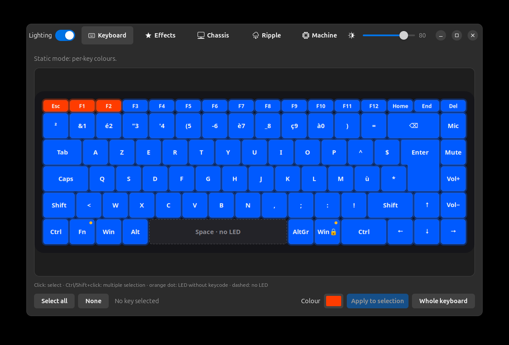
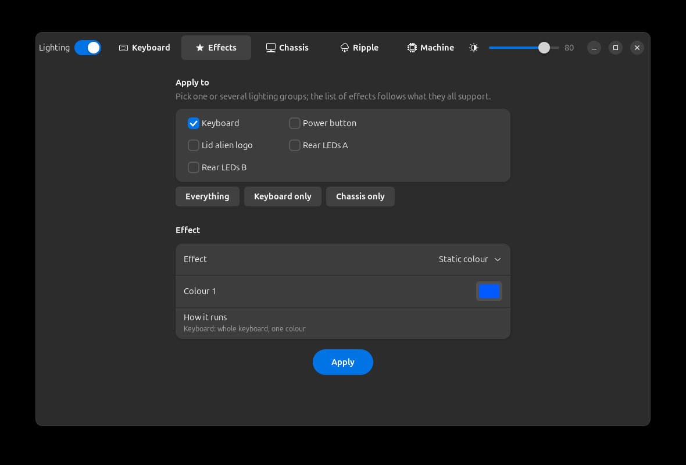
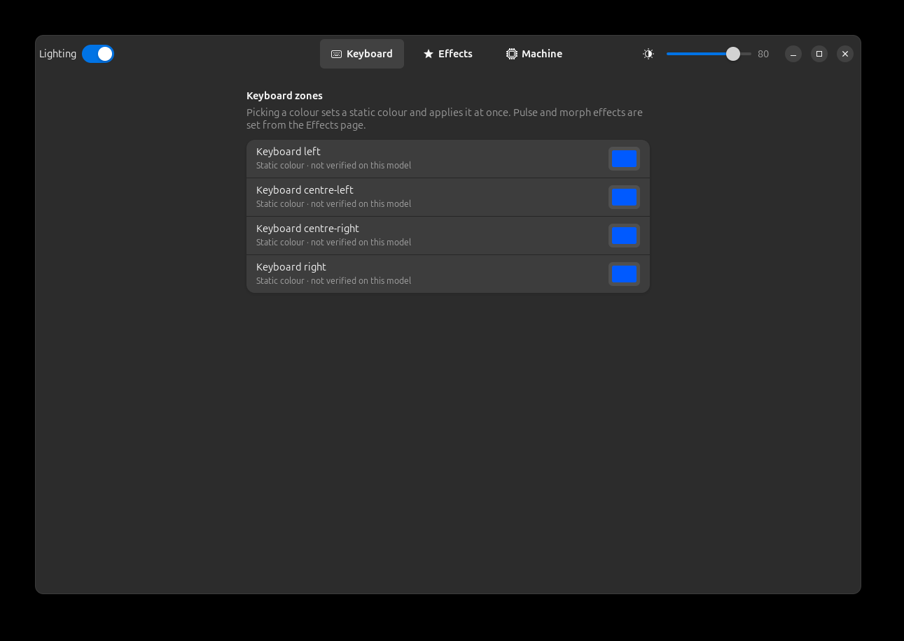

# AlienFX LEDs

Lighting control for Alienware and Dell laptops and desktops on Linux. It covers:

- per-key keyboards;
- 4-zone keyboards;
- power buttons, lid logos and rear light strips;
- older AlienFX machines.

It has three parts:

- a small confined system service, `alienfixd`;
- a GTK 4 app, **AlienFX LEDs**;
- a GNOME Shell Quick Settings toggle.



## Supported machines

| Status | Machines |
|---|---|
| **Verified** (checked with a camera, key by key and zone by zone) | Alienware m15 R7: per-key keyboard, power button, lid logo, rear strip (two channels). See [docs/m15-r7.md](docs/m15-r7.md). |
| **Reported** (community mappings from other projects, not verified here) | 49 models: m15 R1, R3, R4, R6, m16, m17, m18, x17, Area-51m, Aurora R12, Dell G15 5510–5535, G5, G7, and 2010–2017 machines (M11x, M14x, M17x, M18x, 13, 15, 17, Area-51, Aurora R4). See [docs/supported-models.md](docs/supported-models.md). |
| **Anything else with these controllers** | Detected by its USB HID descriptor. The daemon builds a generic model with neutral zone names, and a per-key keyboard can be mapped in a few minutes with the blink wizard. |

Controllers:

| Controller | USB | What it drives |
|---|---|---|
| AW-ELC ("API v4") | `187c:0550`, `187c:0551` | Chassis lights and 4-zone keyboards: static colour, pulse, morph. Power buttons are programmed for every power state. |
| Darfon per-key keyboard ("API v5") | `0d62:*`, FEATURE report `0xCC` | Per-key colours, 6 firmware effects, 5 effects rendered by the service, hardware dimmer, live mode (typing ripple). |
| Legacy AlienFX ("API v2/v3") | `187c:0511`..`0530` | Zone masks, static colour. |
| Kernel `alienware-wmi` | `rgb_zones` sysfs | Pre-2018 desktops (X51, Alpha): static colour. |

**Reported** models may have wrong zone names or indices. The app says so
next to every unverified zone. If yours works (or does not), please open an
issue with `alienfix models` and `alienfix zones`, or send a model file: see
[docs/adding-a-model.md](docs/adding-a-model.md).

## Install

```
./install.sh        # asks for sudo; installs the service, CLI, app and GNOME extension
./uninstall.sh      # removes exactly what install.sh installed (manifest)
```

Needs Python 3, PyGObject, GTK 4 and libadwaita. On Ubuntu 24.04 these are
`python3-gi gir1.2-gtk-4.0 gir1.2-adw-1`. The extension targets GNOME 46: on
X11, reload the shell (Alt+F2, `r`), then run
`gnome-extensions enable alienfix@zeecka.github.io`.

## Use

- **App.** *AlienFX LEDs* in the GNOME menu. The pages follow your machine:
  - **Keyboard**: per-key drawing to scale, or keyboard zones.
  - **Effects**: one effect applied to any mix of lighting groups.
  - **Chassis**: zones.
  - **Ripple**: a ring of colour from each key typed on the built-in
    keyboard, in any window. Colour, speed (2 to 40 keys per second) and
    what shows underneath (the current colours or effect, or a plain
    colour) are saved by the service. Firmware effects cannot run under
    per-key frames, so the service redraws them while the ripple is on.
    Those copies are approximations: only the wave period is measured.
  - **Machine**: detected model, model choice, key map wizard.
- **Quick Settings.** On/off, brightness, presets, ripple on/off.
- **CLI:**

  ```
  alienfix status | layout | zones | models
  alienfix color '#0050ff'
  alienfix keys ESC=#ff0000 Q=#00ff00
  alienfix effect wave --tempo 5 '#ff0000' '#0000ff'
  alienfix zone lid pulse --tempo 6 '#ff0000'
  alienfix model dell-g15-5520 | auto
  alienfix brightness 60 | on | off
  ```

<p>


</p>

## Security model

The per-key keyboard controller is also the internal keyboard: its hidraw
node carries every **keystroke**. Giving the desktop access to it (a udev
rule, a group, an ACL) would give every desktop process a keylogger. This
project does not do that. Instead:

- **One owner.** Only `alienfixd` opens the hidraw nodes. No udev rule opens
  them to users.
- **Confined service.** `alienfixd` runs as root but with **no capabilities**:
  - `CapabilityBoundingSet=` is empty;
  - `DevicePolicy=closed` allows hidraw only;
  - `ProtectSystem=strict` and `PrivateNetwork=yes`;
  - `SystemCallFilter=@system-service`.
- **Narrow API.** The D-Bus interface only has lighting verbs; there is no
  raw report pass-through. Every argument is re-parsed, bounded and rebuilt
  before it reaches a device (`src/alienfix/validate.py`).
  [docs/dbus-api.md](docs/dbus-api.md) describes the interface.
- **polkit.** The active local session may change the lighting. Remote and
  inactive sessions may not.
- **Ripple.** The ripple is off by default. Switching it on goes through
  polkit like any change. While it is on, the service reads key presses of
  the **built-in keyboard only**: the lighting keyboard's own USB device and
  the i8042 keyboard. External keyboards are never opened, and there is no
  grab. A key press only becomes a position for the ring; it is not stored,
  logged or sent. When the ripple or the lighting is off, the input devices
  are closed.

## How it was built

The Alienware m15 R7 support was reverse-engineered with a camera above the
keyboard, because a successful command proves nothing about the LED. The
full method, dead ends included, is in the write-up linked from the author's
blog. The other models come from the community mappings of
[alienfx-tools](https://github.com/T-Troll/alienfx-tools) (MIT),
[akbl](https://github.com/rsm-gh/akbl) (GPL-3.0),
[OpenRGB](https://gitlab.com/CalcProgrammer1/OpenRGB) (GPL-2.0) and
[AWCC](https://github.com/tr1xem/AWCC) (GPL-3.0). Only facts were taken from
them (USB ids, light indices and masks, zone names); `tools/import_models.py`
records the exact source of each model. Thanks to their authors and
contributors.

## Development

```
python3 -m unittest discover -s tests               # validation, encoders, models
MOCK_MODEL=dell-g15-5520 python3 tests/mock_daemon.py &   # real daemon, fake hardware, session bus
ALIENFIX_BUS=session gui/alienfx-leds                # the app against it
```

## Licence

GPL-3.0-or-later. See [LICENSE](LICENSE).
