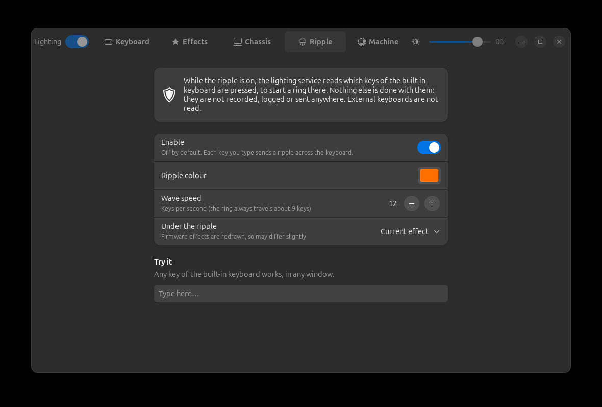
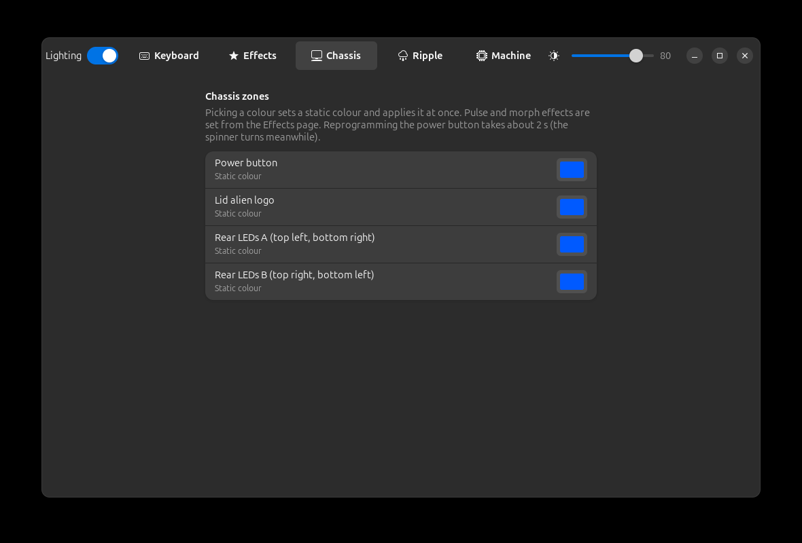
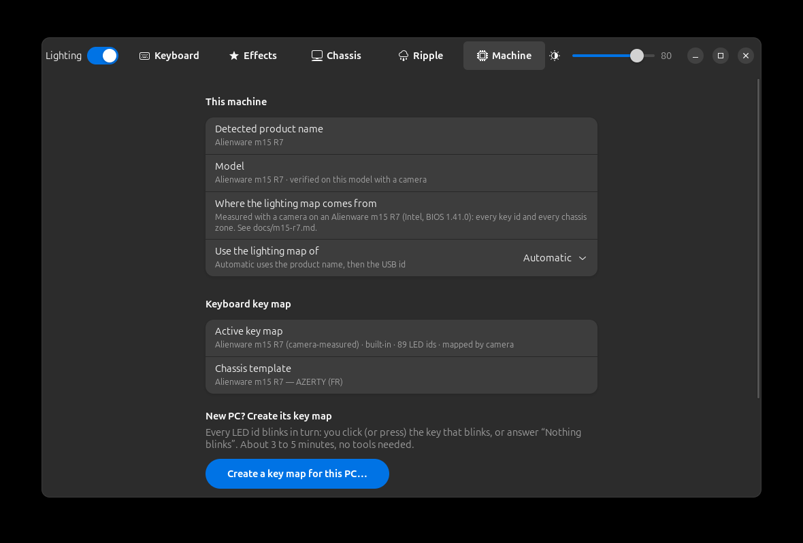

<div align="center">


# AlienFX LEDs

**Keyboard and chassis lighting for Alienware and Dell machines on Linux.**<br>
Per-key colours, effects, a typing ripple, and a toggle in GNOME Quick Settings, all driven by a small, locked-down service.

[](LICENSE)


<br>


[Features](#-features) ·
[Supported machines](#-supported-machines) ·
[Install](#-install) ·
[Usage](#-usage) ·
[Security](#-security-model) ·
[Development](#-development)


</div>

## ✨ Features

| | |
|---|---|
| ⌨️ **Per-key colours** | The keyboard drawn to scale from its real geometry. Click or Ctrl/Shift-click keys, pick a colour, apply. |
| 🌈 **Effects** | 5 firmware effects (breathing, wave, pulse, two-colour pulse, sweep) plus 5 rendered by the service (rainbow, spectrum, colour morph, starlight, gradient). One effect can go to any mix of keyboard and chassis lights. |
| 💡 **Chassis lights** | Power button, lid logo, rear light strip: static colour, pulse, morph. The power button keeps its colour asleep and off. |
| 💧 **Typing ripple** | A ring of colour from every key you press, over the current effect or a plain colour. Adjustable colour and speed (2 to 40 keys per second). |
| 🎛️ **Quick Settings** | On/off, brightness, presets and the ripple, straight from the GNOME panel. |
| 🖥️ **Command line** | `alienfix` does everything the app does, for scripts. |
| 🧭 **Any model** | Unknown machine? A generic model is built from the controllers found, and the *“does it blink?”* wizard maps a per-key keyboard in 3 to 5 minutes. |
| 💾 **Persistent** | Settings survive reboots and are re-applied after suspend. |

<table>
<tr>
<td width="50%"><br><sub><b>Effects</b>: one effect, applied to any mix of lights.</sub></td>
<td width="50%"><br><sub><b>Ripple</b>: colour, speed and what shows underneath.</sub></td>
</tr>
<tr>
<td width="50%"><br><sub><b>Chassis</b>: power button, lid logo, rear strip.</sub></td>
<td width="50%"><br><sub><b>Machine</b>: detected model, key map, wizard.</sub></td>
</tr>
</table>

## 💻 Supported machines

| Status | Machines |
|---|---|
| 🟢 **Verified**<br><sub>checked with a camera, key by key and zone by zone</sub> | **Alienware m15 R7**: per-key keyboard, power button, lid logo, rear strip (two channels). See [docs/m15-r7.md](docs/m15-r7.md). |
| 🟠 **Reported**<br><sub>community mappings from other projects, not verified here</sub> | **49 models**: m15 R1, R3, R4, R6, m16, m17, m18, x17, Area-51m, Aurora R12, Dell G15 5510–5535, G5, G7, and 2010–2017 machines (M11x, M14x, M17x, M18x, 13, 15, 17, Area-51, Aurora R4). Full list: [docs/supported-models.md](docs/supported-models.md). |
| ⚪ **Anything else with these controllers** | Detected by its USB HID descriptor. The service builds a generic model with neutral zone names, and a per-key keyboard can be mapped with the blink wizard. |

> [!NOTE]
> **Reported** models may have wrong zone names or indices; the app says so next to every unverified zone.
> Whether yours works or not, please open an issue with the output of `alienfix models` and `alienfix zones`,
> or send a model file: see [docs/adding-a-model.md](docs/adding-a-model.md).

<details>
<summary><b>Controllers</b></summary>

| Controller | USB | What it drives |
|---|---|---|
| AW-ELC (“API v4”) | `187c:0550`, `187c:0551` | Chassis lights and 4-zone keyboards: static colour, pulse, morph. Power buttons are programmed for every power state. |
| Darfon per-key keyboard (“API v5”) | `0d62:*`, FEATURE report `0xCC` | Per-key colours, 5 firmware effects, 5 effects rendered by the service, hardware dimmer, live mode, typing ripple. |
| Legacy AlienFX (“API v2/v3”) | `187c:0511`..`0530` | Zone masks, static colour. |
| Kernel `alienware-wmi` | `rgb_zones` sysfs | Pre-2018 desktops (X51, Alpha): static colour. |

</details>

<p align="center">

<br><sub>A Dell G15: its 4-zone keyboard is listed as zones.</sub>
</p>

## 📦 Install

**1. Dependencies** (Python 3, PyGObject, GTK 4, libadwaita). On Ubuntu 24.04:

```sh
sudo apt install python3-gi gir1.2-gtk-4.0 gir1.2-adw-1
```

**2. Install** the service, the command line, the app and the GNOME extension:

```sh
./install.sh        # asks for sudo
```

**3. Enable the Quick Settings toggle** (GNOME 46). On X11, reload the shell with <kbd>Alt</kbd>+<kbd>F2</kbd>, `r`, <kbd>Enter</kbd>; on Wayland, log out and back in. Then:

```sh
gnome-extensions enable alienfix@zeecka.github.io
```

To remove everything, `./uninstall.sh` deletes exactly what `install.sh` installed (it keeps a manifest).

## 🚀 Usage

### The app

Open **AlienFX LEDs** from the GNOME menu. The pages follow your machine:

- **Keyboard**: the per-key drawing to scale, or the keyboard zones.
- **Effects**: one effect applied to any mix of lighting groups.
- **Chassis**: one colour per zone, applied at once.
- **Ripple**: a ring of colour from each key typed on the built-in keyboard, in any window. Colour, speed and what shows underneath (the current colours or effect, or a plain colour) are saved by the service.
- **Machine**: the detected model, the choice of model, key map import/export and the key map wizard.

The header bar holds the master switch and the brightness slider.

> [!TIP]
> While the ripple is on, firmware effects cannot run under per-key frames, so the service redraws them in software.
> These copies are close but not identical: only the wave period was measured.

### Quick Settings

The **Lighting** tile turns everything on or off. Its menu has the brightness slider, effect presets, the **Typing ripple** switch and a shortcut to the app.

### Command line

```sh
alienfix status | layout | zones | models
alienfix color '#0050ff'                         # whole keyboard
alienfix keys ESC=#ff0000 Q=#00ff00              # per key (names from `alienfix layout`)
alienfix effect wave --tempo 5 '#ff0000' '#0000ff'
alienfix zone lid pulse --tempo 6 '#ff0000'      # zone ids from `alienfix zones`
alienfix model dell-g15-5520 | auto
alienfix brightness 60 | on | off
```

Tempo goes from 1 to 30; higher is slower.

## 🔒 Security model

> [!IMPORTANT]
> The per-key keyboard controller **is** the internal keyboard: its hidraw node carries every keystroke.
> Opening it to the desktop (a udev rule, a group, an ACL) would hand every desktop process a keylogger.
> AlienFX LEDs never does that.

- **One owner.** Only `alienfixd` opens the hidraw nodes. No udev rule opens them to users.
- **Confined service.** `alienfixd` runs as root but with **no capabilities**: empty `CapabilityBoundingSet=`, `DevicePolicy=closed` (hidraw, plus input devices read-only for the ripple), `ProtectSystem=strict`, `PrivateNetwork=yes`, `SystemCallFilter=@system-service`.
- **Narrow API.** The D-Bus interface only has lighting verbs, with no raw report pass-through. Every argument is re-parsed, bounded and rebuilt before it reaches a device ([`validate.py`](src/alienfix/validate.py)). The interface is described in [docs/dbus-api.md](docs/dbus-api.md).
- **polkit.** The active local session may change the lighting. Remote and inactive sessions may not.

> [!WARNING]
> **About the typing ripple.** It is **off by default**, and switching it on goes through polkit like any change.
> While it is on, the service reads key presses of the **built-in keyboard only**: the lighting keyboard's own USB device and the i8042 keyboard.
> External keyboards are never opened, and keys are not intercepted. A key press only becomes a position for the ring:
> it is not stored, logged or sent. When the ripple or the lighting is off, the input devices are closed.

## 🔬 How it was built

The Alienware m15 R7 support was reverse-engineered with a webcam pointed at the keyboard, because a successful command proves nothing about an LED. The full method, dead ends included, is in the write-up on the author's blog.

The other models come from the community mappings of
[alienfx-tools](https://github.com/T-Troll/alienfx-tools) (MIT),
[akbl](https://github.com/rsm-gh/akbl) (GPL-3.0),
[OpenRGB](https://gitlab.com/CalcProgrammer1/OpenRGB) (GPL-2.0) and
[AWCC](https://github.com/tr1xem/AWCC) (GPL-3.0).
Only facts were taken from them (USB ids, light indices and masks, zone names), and [`tools/import_models.py`](tools/import_models.py) records the exact source of each model. Thanks to their authors and contributors. 🙏

## 🛠️ Development

```sh
python3 -m unittest discover -s tests                      # validation, encoders, models, ripple
MOCK_MODEL=dell-g15-5520 python3 tests/mock_daemon.py &    # the real service, fake hardware, session bus
ALIENFIX_BUS=session gui/alienfx-leds                      # the app against it
```

<details>
<summary><b>Repository layout</b></summary>

| Path | What |
|---|---|
| [`src/alienfix/`](src/alienfix) | The service: D-Bus API, validation, report encoders, effects, models, key maps |
| [`gui/alienfx-leds`](gui/alienfx-leds) | The GTK 4 / libadwaita app |
| [`bin/alienfix`](bin/alienfix) | The command line |
| [`gnome-extension/`](gnome-extension) | The Quick Settings toggle |
| [`data/models/`](data/models) | One file per machine model |
| [`data/chassis/`](data/chassis), [`data/profiles/`](data/profiles) | Keyboard geometry, and the shipped key maps |
| [`tests/`](tests) | Unit tests and the mock service |

</details>

## 📄 Licence

[GPL-3.0-or-later](LICENSE).
