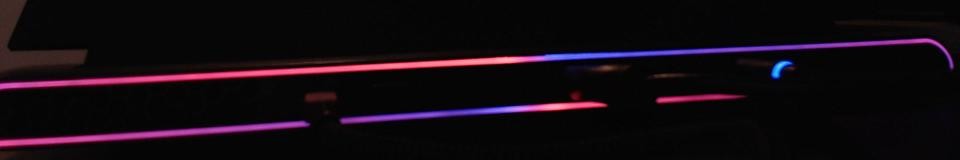

# Alienware m15 R7: what was measured

Everything below was checked on one Alienware m15 R7 (Intel i7-12700H, BIOS
1.41.0, Ubuntu 24.04) with a Logitech C920. The camera was fixed above the
keyboard, and later aimed at the back of the lid. It ran with manual exposure,
fixed gain and white balance, and locked focus. Each light was switched on
alone against a dark reference, and several frames were averaged. Command exit
codes were never taken as proof. The full French lab notebook, recordings and
tooling are in the investigation repository; this page is the summary the
code relies on.

## Two controllers

| | AW-ELC `187c:0550` | Darfon `0d62:dabc` |
|---|---|---|
| HID | vendor page `0xFF00`, 33-byte INPUT and OUTPUT, no report id | vendor page `0xFF89`: FEATURE `0x5A` (16 bytes) and FEATURE **`0xCC`** (63 bytes), **plus the keyboard itself** (INPUT 1) and consumer keys (INPUT 2) |
| Lights | power button, lid logo, rear strip (two channels) | the per-key keyboard backlight |
| Time per command | 64 ms (same over interrupt OUT, `HIDIOCSOUTPUT` and FEATURE) | 1.5 ms |

The Darfon node also carries the keystrokes. Whoever can open it can read what
is typed, so only the confined daemon opens it (see the README).

## Chassis (AW-ELC, "API v4")

| ELC id | Light | How it responds |
|---|---|---|
| 2 | Power button | Only through the power-state sequence, repeated for states `0x5B`..`0x60`: `03 22 00 04 00 <s>` (remove), `03 22 00 01 00 <s>` (start), `03 23 01 00 01 02` (select), `03 24 00 07 d0 00 fa R G B` (colour), `03 22 00 02 00 <s>` (finish). Then `03 21 00 05 00 ff` (play). 32 commands, 2.05 s. `03 27` does not change it. |
| 3 | Lid alien logo | `03 27 R G B 00 01 03` (set one colour); pulse and morph actions. |
| 0 | Rear strip, channel A | Upper strip on the left, lower strip on the right. |
| 1 | Rear strip, channel B | Upper strip on the right, lower strip on the left. |
| 4–15 | nothing visible | Ids above 15 were not tested. |

- With id 0 red and id 1 blue at the same time, the upper strip is red on the
  left and blue on the right, and the lower strip is the other way round.
  These are two **independent** channels.
  - *Assumed, not measured:* a ring-shaped light guide fed by two LEDs, which
    would explain why the ends blend.
- Actions (`03 23` select + `03 24` colour with `[type, 07, opcode, 00, tempo, R, G, B]`):
  - type 1 (pulse): the logo pulsed with a period of about 2.4 s at tempo 6.
  - type 2 (morph): id 0 faded between red and blue while id 1 stayed steady.
  - Neither was observed on the power button, which was out of view.
- The status byte read back is an echo of the last command. It proves
  reception, not effect.
- `03 26` (dim) had no visible effect. Chassis brightness is therefore done by
  scaling the colours.
- A round blue LED at the rear does not react to any id: it is not on this
  controller.

## Keyboard (Darfon, "API v5"; bytes after the `0xCC` report id)

- `80 01 fe 00 00 01 01 01` switches to per-key mode. After a hardware effect,
  per-key colours stay invisible until this is sent. Colour packets sent in
  the first 20–50 ms after the switch are **dropped silently**, so the daemon
  waits 100 ms.
- `8c 02 00` followed by up to 15 × `[id+1, R, G, B]` lights exactly the keys
  addressed.
- `83 38 9c <0..255>` is a real hardware dimmer: monotonic, and colours
  survive 0.
- `80 <type> <tempo> 00 00 01 01 01 <n-1> R1 G1 B1 R2 G2 B2`:

  | type | effect |
  |---|---|
  | 2 | breathing |
  | 3 | wave (two colours with n = 2) |
  | 4 | frozen band, **not** a dual-colour wave |
  | 5–7 | nothing |
  | 8 | pulse |
  | 9 | alternates two colours |
  | A | sweep |
  | B | nothing without typing (not verified) |

  Tempo is a period: the wave loops in about 0.6 s × tempo.
- Key map: 89 ids for 85 keys; the space bar has no LED.
  - Ids `k` and `k+140` address the same LED, except id 82 (the ISO `<` key).
  - Four keys answer to two ids at the same spot: Backspace 34/35, Caps Lock
    60/61, Left Shift 80/81 and Win 102/103.
  - Fn (101) and Win-lock (109) have LEDs.
  - Media column: 16 mute, 17 volume down, 18 volume up, 19 mic mute.
- Throughput through the whole stack (client → D-Bus → daemon → keyboard),
  with 89-id frames: 42 frames per second.
